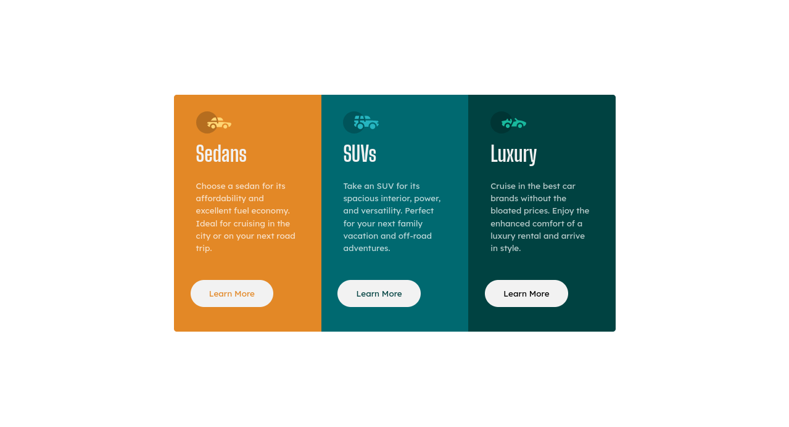

# 3-column preview card component

## Overview

The challenge is to build out a 3-column preview card component and get it looking as close to the design as possible.

Users should be able to:

- View the optimal layout depending on their device's screen size
- See hover states for interactive elements

### Screenshot

### Links

- Solution URL: [Challenge if you want to check it out](https://your-solution-url.com)
- Live Site URL: [Live site](https://andrew-lc.github.io/Preview-Card-3-Column/)

### Built with

- HTML
- CSS custom properties
- CSS Grid
- Mobile-first workflow

### What I learned

I was able to learn grid container and item properties a bit more in depth due to this project.

### Useful resources

- [CSS-Grid](https://css-tricks.com/snippets/css/complete-guide-grid/)
